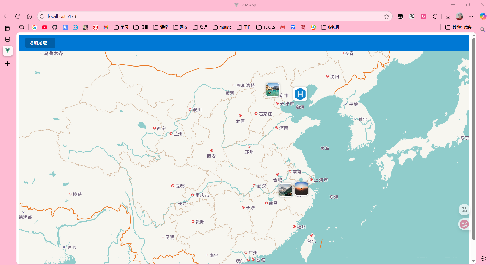
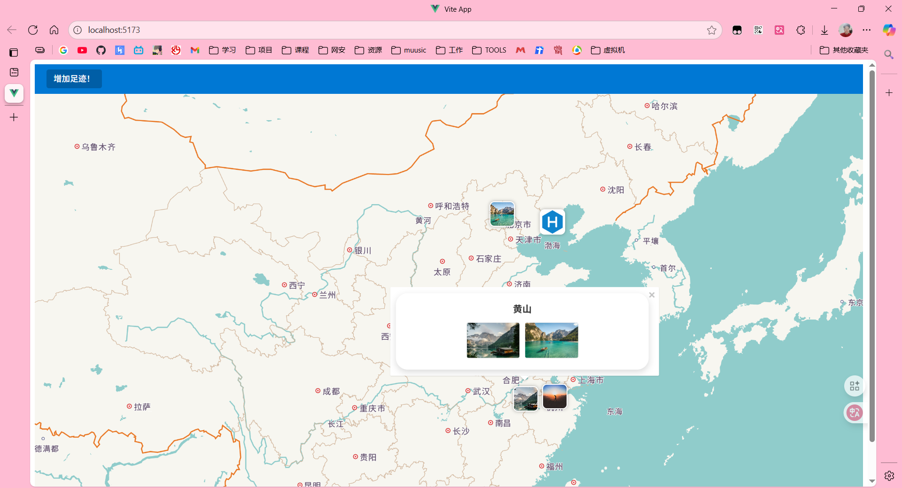
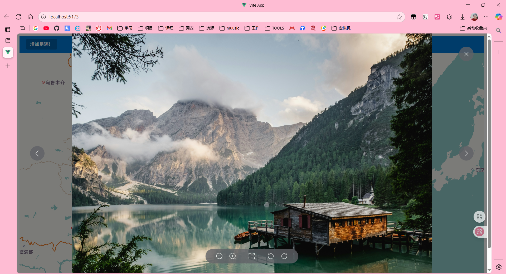
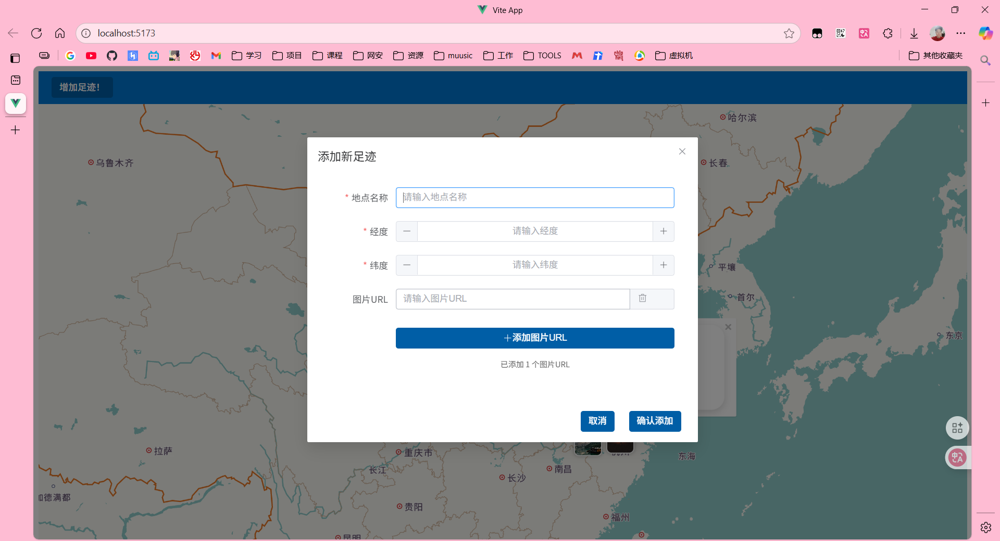

# 🌍 Travel Footprints Map

[中文说明](./README.md) | English

A travel footprint recording app built with **Vue 3 + Flask + local JSON file**, using **AMap API** for map rendering.

Images are stored via **URL links** (e.g., OSS, Cloudflare, GitHub Pages + jsDelivr).  
Since the dataset is small (mainly text + URLs), a **local JSON file** is used as a lightweight database.

---

## ✨ Features

- 📍 Add travel footprints (name, coordinates, and photos)
- 🗺️ Display markers on AMap
- 🖼️ Store photos via URLs
- 💾 Use JSON file as lightweight backend storage

---

## 📦 Project Structure

├── assets # Static files
├── backend # Backend source code
│ ├── server.py # Flask backend
│ └── markers.json # Data storage (JSON file)
├── public
├── src # Frontend source code
├── index.html
├── jsconfig.json
├── package-lock.json
├── package.json
└── vite.config.js

---

## 🚀 Quick Start

### 1️⃣ Configure environment variables `.env`

```bash
VITE_AMAP_KEY=your_amap_key
# ↑ Replace with your AMap API key
VITE_API_BASE_URL=http://localhost:5000/
# ↑ Replace with your backend API base URL
```
### 2️⃣ Run the Backend

```bash
cd backend
python3 server.pyBy default, the backend runs at http://localhost:5000.
```

### 3️⃣ Run the Frontend

```
npm install
npm run dev
```


Build for production:

```
npm run build
```

## 📷 Screenshots










# 
