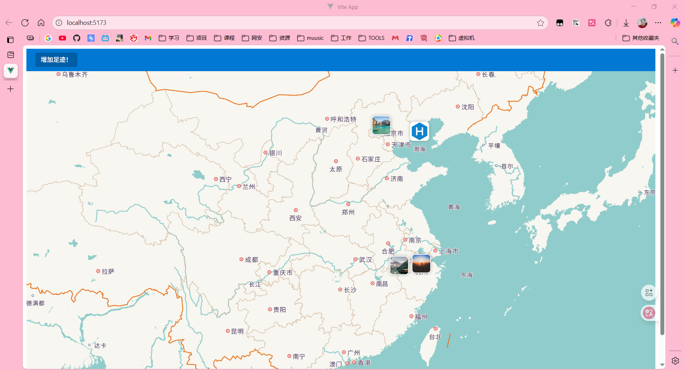
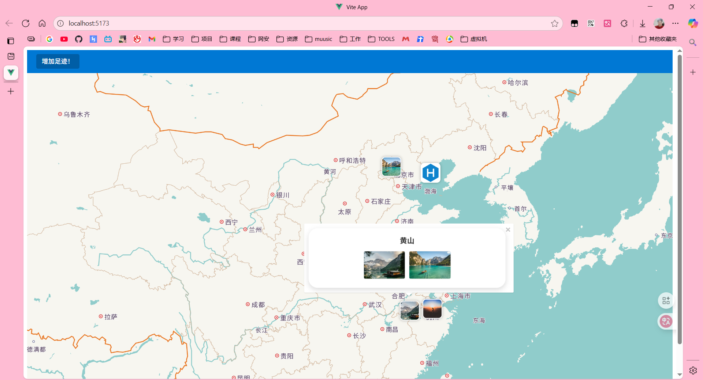
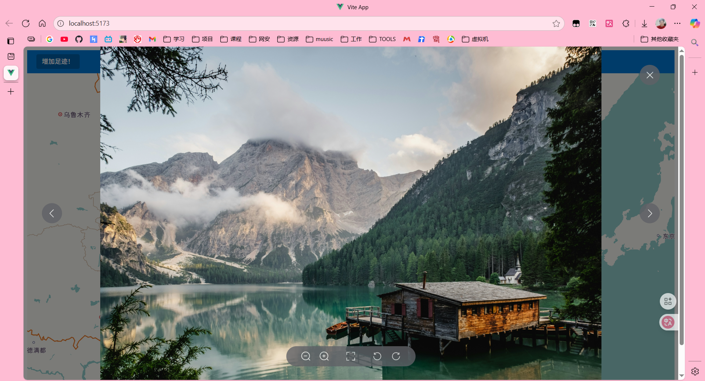
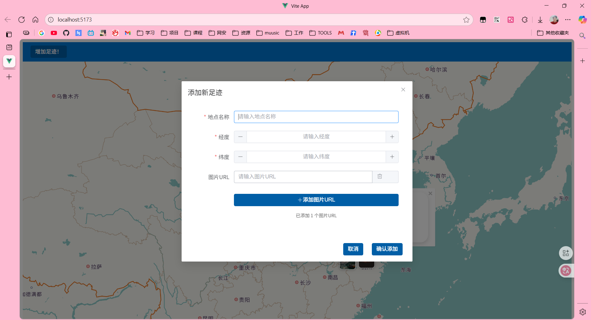

# Travel Footprints Map

A travel footprint tracking application with a **Vue 3** frontend and **Go** backend, using **SQLite** for data persistence and **AMap (Gaode Map)** for map rendering.

---

## Features

- Add, edit, and delete travel footprints with name, coordinates, category, visit date, notes, and photos
- Interactive map markers on AMap with category-based color coding
- Photo upload (local file) with cover image and gallery preview
- Keyword search and category filtering
- Right-click on map to add footprints in add mode
- Click markers to view detailed info card with cover photo, notes, and photo gallery
- Seven preset categories: Natural Scenery, Historical Sites, Food, Cities, Art, Adventure, Islands

---

## Project Structure

```
vueTravelFootprints/
├── backend-go/              # Go backend
│   ├── main.go              # Entry point, route registration
│   ├── config/config.go     # Environment variable configuration
│   ├── models/models.go     # Data models and request/response structs
│   ├── database/database.go # SQLite initialization, CRUD, search, seed data
│   ├── handlers/
│   │   ├── markers.go       # Footprint CRUD + search API handlers
│   │   └── upload.go        # Image upload handler
│   ├── middleware/cors.go   # CORS middleware
│   ├── data/travel.db       # SQLite database file
│   └── uploads/             # Uploaded images directory
├── src/                     # Vue 3 frontend
│   ├── api/
│   │   ├── request.js       # Axios instance with interceptors
│   │   └── markers.js       # Footprint API calls
│   ├── stores/markers.js    # Pinia store for state management
│   ├── components/main/
│   │   ├── HeaderBar.vue    # Top bar with search, filter, add-mode toggle
│   │   ├── MapPart.vue      # Map component with AMap integration
│   │   ├── MarkerInfo.vue   # Info card shown on marker click
│   │   └── MarkerAvatar.vue # Custom marker avatar on map
│   ├── views/MapView.vue    # Main map view page
│   ├── router/index.js      # Vue Router config
│   └── main.js              # App entry point
├── assets/                  # Static assets (CSS, images)
├── dist/                    # Production build output
├── doc/upgrade.md           # Upgrade suggestions
├── .env                     # Environment variables
├── .env.eg                  # Environment variable template
├── index.html
├── package.json
└── vite.config.js
```

---

## Quick Start

### 1. Environment Variables

Copy `.env.eg` to `.env` and fill in your values:

```
VITE_AMAP_KEY=your_amap_key_here
VITE_API_BASE_URL=http://localhost:5000/api
```

### 2. Start Go Backend

```
cd backend-go
go run main.go
```

Or use the pre-built binary:

```
cd backend-go
.\travel-server.exe
```

The server runs on `http://localhost:5000` by default. Configure via environment variables:

| Variable   | Default         | Description          |
|------------|-----------------|----------------------|
| `PORT`     | `5000`          | Server port          |
| `DB_PATH`  | `./data/travel.db` | SQLite database path |
| `UPLOAD_DIR` | `./uploads`   | Uploaded images directory |

### 3. Start Frontend

```
npm install
npm run dev
```

Build for production:

```
npm run build
```

---

## API Reference

| Method | Path | Description |
|--------|------|-------------|
| `GET` | `/api/markers` | Get all footprints |
| `GET` | `/api/markers/{id}` | Get single footprint |
| `GET` | `/api/markers/search?keyword=&category=&startDate=&endDate=` | Search and filter |
| `POST` | `/api/markers` | Create footprint |
| `PUT` | `/api/markers/{id}` | Update footprint |
| `DELETE` | `/api/markers/{id}` | Delete footprint |
| `POST` | `/api/upload` | Upload image |
| `GET` | `/uploads/{filename}` | Static file serving |

---

## Tech Stack

| Layer | Technology |
|-------|-----------|
| Frontend | Vue 3, Pinia, Element Plus, Axios, AMap JSAPI |
| Backend | Go, net/http (standard library), SQLite (modernc.org/sqlite) |
| Build | Vite |
| Database | SQLite |

---

## Screenshots







