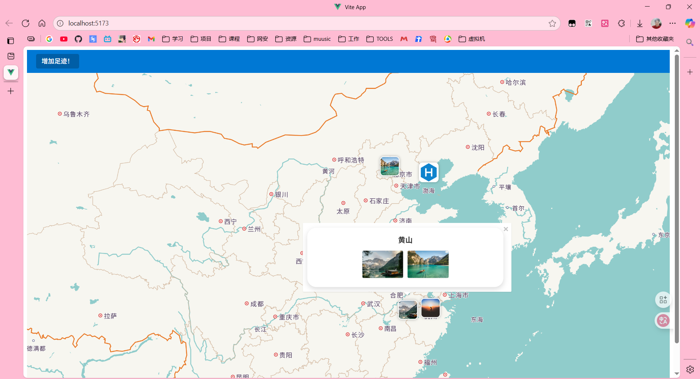
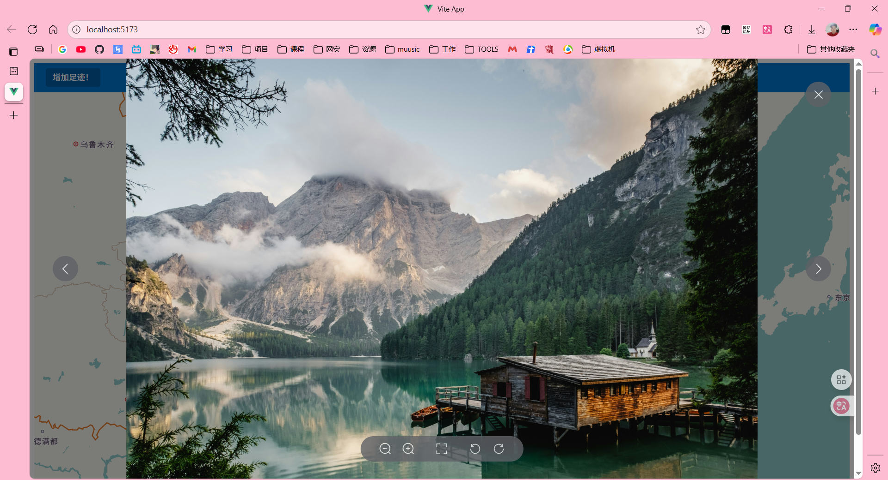

# 🌍 Travel Footprints Map 足迹地图

中文说明 | [English](./README.en.md)

一个基于 **Vue 3 + Flask + 本地 JSON 文件** 的旅行足迹记录应用，使用 **高德地图 API (AMap)** 进行地图渲染。

Images are stored via **URL links** (e.g. OSS, Cloudflare, GitHub Pages + jsDelivr).
 Since the dataset is small (text + URLs), a **local JSON file** is used as a lightweight database.

------

## ✨ 功能 Features

- 📍 添加旅行足迹 (Add footprints with name, coordinates, and photos)
- 🗺️ 高德地图标记展示 (Render markers on AMap)
- 🖼️ 图片通过 URL 存储 (Store photos via URLs)
- 💾 JSON 文件作为数据库 (Lightweight JSON file as backend storage)

------

## 📦 项目结构 Project Structure

```
├── assets          # 静态文件
├── backend 	   # 后端源代码
│   ├── backend.py  # 后端代码
│   └── markers.json # 数据json
├── public			
├── src			# 前端源代码
├── index.html
├── jsconfig.json
├── package-lock.json
├── package.json
└── vite.config.js
```

------

## 🚀 快速开始 Quick Start

### 1️⃣ 配置环境变量 `.env`

```
VITE_AMAP_KEY=your_amap_key
# ↑ 修改为你key
VITE_API_BASE_URL=http://localhost:5000/
# ↑ 修改为你后端的地址
```

### 2️⃣ 启动后端 Backend

```
cd backend
python3 server.py
```

默认运行在 `http://localhost:5000`。

### 3️⃣ 启动前端 Frontend

```
npm install
npm run dev
```

构建静态资源：

```
npm run build
```

# 📷 示例截图 Screenshots







# 
